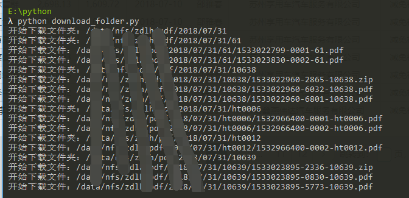

### 为什么要用Python脚本下载以及基本介绍

经常会有人需要从远程服务器下载一些文件资源，下载个别小文件可以直接用sz等命令，但是，需要下载一个文件夹呢？sz就不行了，这时候当然可以先压缩文件夹，然后下载，这样也是可以的，只要文件不是很大，那么，有没有其他办法下载文件夹呢？办法当然是有的，就是写Python脚本，然后通过paramiko模块就可以从远程传输下载文件夹到本地了，是不是很方便呢……

paramiko模块提供了ssh及sftp进行远程登录服务器执行命令和上传下载文件的功能。这是一个第三方的软件包，使用之前需要先进行安装，我们这里主要利用sftp进行下载传输文件

<!-- more -->

就像下图中的运行，可以一个一个的循环下载文件



### 使用时候的基本配置

下面的这些信息需要自己配置一下，即初始化一些参数，包括服务器信息以及远程文件和本地文件的存放路径配置

```
# 服务器连接信息
host_name = '172.0.0.1'
user_name = 'root'
password = 'root'
port = 22
# 远程文件路径（需要绝对路径）
remote_dir = '/data/nfs/zdlh/pdf/2018/07/31'
# 本地文件存放路径（绝对路径或者相对路径都可以）
local_dir = 'file_download/'
```

### 实现源码

```
#!/usr/bin/env python
# -*- coding: utf-8 -*-

"""
通过paramiko从远处服务器下载文件资源到本地
author: gxcuizy
time: 2018-08-01
"""

import paramiko
import os
from stat import S_ISDIR as isdir


def down_from_remote(sftp_obj, remote_dir_name, local_dir_name):
    """远程下载文件"""
    remote_file = sftp_obj.stat(remote_dir_name)
    if isdir(remote_file.st_mode):
        # 文件夹，不能直接下载，需要继续循环
        check_local_dir(local_dir_name)
        print('开始下载文件夹：' + remote_dir_name)
        for remote_file_name in sftp.listdir(remote_dir_name):
            sub_remote = os.path.join(remote_dir_name, remote_file_name)
            sub_remote = sub_remote.replace('\\', '/')
            sub_local = os.path.join(local_dir_name, remote_file_name)
            sub_local = sub_local.replace('\\', '/')
            down_from_remote(sftp_obj, sub_remote, sub_local)
    else:
        # 文件，直接下载
        print('开始下载文件：' + remote_dir_name)
        sftp.get(remote_dir_name, local_dir_name)


def check_local_dir(local_dir_name):
    """本地文件夹是否存在，不存在则创建"""
    if not os.path.exists(local_dir_name):
        os.makedirs(local_dir_name)


if __name__ == "__main__":
    """程序主入口"""
    # 服务器连接信息
    host_name = '172.17.2.18'
    user_name = 'dev'
    password = 'dev@zdlh'
    port = 22
    # 远程文件路径（需要绝对路径）
    remote_dir = '/data/nfs/zdlh/pdf/2018/07/31'
    # 本地文件存放路径（绝对路径或者相对路径都可以）
    local_dir = 'file_download/'

    # 连接远程服务器
    t = paramiko.Transport((host_name, port))
    t.connect(username=user_name, password=password)
    sftp = paramiko.SFTPClient.from_transport(t)

    # 远程文件开始下载
    down_from_remote(sftp, remote_dir, local_dir)

    # 关闭连接
    t.close()
```

### 结束语

在Python中，可以很好地利用Parmmiko的sftp完成文件传输操作。大家有什么疑问或者想法，可以留言或者联系我。


